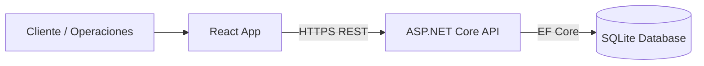

# 🟡 ElectraVisits – Gestión de Visitas Técnicas

> Prueba Técnica – Arquitectura Clean / DDD  
> Backend: .NET 9 + EF Core + SQLite  
> Frontend: React + TypeScript
> Link Backend desplegado : https://electravisits-api-jq-fdf6bkhuetbyfna5.brazilsouth-01.azurewebsites.net/swagger/index.html
> Link Frontend App funcional: https://agreeable-ocean-01fdfb50f-preview.eastus2.1.azurestaticapps.net/

---

# 📌 Descripción

**ElectraVisits** es una solución web diseñada para gestionar el agendamiento de visitas técnicas residenciales.

Permite:

- 🏠 Clientes agendar visitas según disponibilidad (AM/PM).
- 🛠 Operaciones consultar y gestionar citas.
- 🔐 Control de acceso por roles (Admin, Operations).
- ♻️ Autenticación moderna con JWT + Refresh Token.
- 🧱 Arquitectura limpia y escalable.

---

# 🏗 Arquitectura

La solución está implementada siguiendo **Clean Architecture + DDD**, separando responsabilidades en cuatro proyectos:

- ElectraVisits.Domain  
- ElectraVisits.Application  
- ElectraVisits.Infrastructure  
- ElectraVisits.Api  

## 🔹 Domain
- Entidades del negocio
- Enums
- Interfaces de repositorios
- Reglas de dominio

## 🔹 Application
- Casos de uso
- Servicios de aplicación
- DTOs
- Interfaces de servicios

## 🔹 Infrastructure
- EF Core (AppDbContext)
- Implementación de repositorios
- JWT & BCrypt
- Seed inicial
- Configuraciones de persistencia

## 🔹 API
- Controladores REST
- Middlewares de seguridad
- Configuración de DI
- Pipeline HTTP

---

# 📊 Diagrama Conceptual



# ☁ Arquitectura de Despliegue (Azure)

````mermaid
flowchart TB
    Browser[Cliente Web] --> Frontend[Azure Static Web Apps]
    Frontend --> API[Azure App Service - .NET 9 API]
    API --> Database[(Azure SQL Database)]
    API --> AzureDevOps[Azure DevOps CI/CD]
````

## Despliegue propuesto

* 🌐 **Frontend:** Azure Static Web Apps
* 🖥 **Backend:** Azure App Service
* 🗄 **Base de datos:** Azure SQL (producción)
* 🔄 **CI/CD:** Azure DevOps

---

# 🔐 Seguridad

El sistema implementa:

* 🔑 JWT Access Token
* ♻️ Refresh Token con rotación
* 🔐 Hash de contraseña con BCrypt
* 👥 Control de acceso por roles (Admin, Operations)
* 🛡 Middlewares personalizados:
* Manejo global de excepciones
* Security headers
* Middleware de control de autenticación

---

# 🗄 Base de Datos

Motor utilizado: **SQLite**

Archivo generado:

```
electra.db
````


## Tablas principales

* Users
* Roles
* UserRoles
* RefreshTokens
* Customers
* Appointments

## Restricciones

* NIC único
* Email único
* Role Name único
* RefreshToken único
* Restricción de cita duplicada por:

```
(CustomerId, Date, TimeSlot)
```


---

# 🚀 Setup Backend

## 1️⃣ Clonar repositorio

```bash
git clone <repo-url>
cd ElectraVisits
````

## 2️⃣ Restaurar paquetes

```bash
dotnet restore
````

## 3️⃣ Ejecutar migraciones

```bash
dotnet ef database update -p ElectraVisits.Infrastructure -s ElectraVisits.Api
````

## 4️⃣ Ejecutar API

```bash
dotnet run --project ElectraVisits.Api

````

## API disponible en:

```bash
http://localhost:5033
````

## 🔑 Usuario Seed (Development) Se crea automáticamente:

```bash
Email: admin@test.com
Password: 123456
Rol: Admin
````

# 🌐 Endpoints Principales

## 🔐 Auth

| Método | Endpoint           | Descripción         |
| ------ | ------------------ | ------------------- |
| POST   | /api/auth/register | Registro de usuario |
| POST   | /api/auth/login    | Login               |
| POST   | /api/auth/refresh  | Renovar token       |
| POST   | /api/auth/logout   | Cerrar sesión       |

---

## 👥 Customers (Admin / Operations)

| Método | Endpoint                    | Descripción       |
| ------ | --------------------------- | ----------------- |
| POST   | /api/customers              | Crear cliente     |
| GET    | /api/customers/by-nic/{nic} | Consultar cliente |

---

## 📅 Appointments

| Método | Endpoint                      | Descripción          |
| ------ | ----------------------------- | -------------------- |
| POST   | /api/appointments             | Crear cita (Público) |
| GET    | /api/appointments?nic=        | Listar citas         |
| PATCH  | /api/appointments/{id}/status | Cambiar estado       |

---

# 📌 Reglas de Negocio

* NIC obligatorio.  
* Fecha no puede ser pasada.  
* TimeSlot:  
  * 1 = AM  
  * 2 = PM  
* Si cliente no existe al agendar, se crea automáticamente.  
* No se permite duplicar cita misma fecha + franja.  

---

# 🎨 Frontend

Desarrollado en:

* React  
* TypeScript  
* Arquitectura basada en componentes  
* Manejo automático de refresh token  
* Diseño corporativo inspirado en Celsia  

Incluye:

* Página pública de agendamiento  
* Login  
* Dashboard de operaciones  
* Gestión de citas  

---

# 📌 Decisiones Técnicas

* Clean Architecture para desacoplamiento y escalabilidad.  
* SQLite para simplicidad en entorno de prueba.  
* JWT + Refresh Token para seguridad moderna.  
* BCrypt para protección de contraseñas.  
* Seed automático para facilitar pruebas.  

---

# ⚠ Limitaciones

* SQLite no es ideal para entornos productivos distribuidos.  
* No incluye pruebas unitarias automatizadas.  
* No incluye contenedorización (Docker).  
* No incluye pipeline CI/CD configurado.  

---

# 📈 Mejoras Futuras

* Tests unitarios (xUnit)  
* Dockerización  
* Integración con Azure SQL  
* CI/CD automatizado  
* Logs estructurados  

---

# 🏁 Estado del Proyecto

* ✔ Backend completo  
* ✔ Seguridad implementada  
* ✔ Seed funcional  
* ✔ Migraciones configuradas  
* ✔ Arquitectura lista para producción  

---

# 👨‍💻 Autor

Jerónimo Parra Quintero 

Desarrollado como prueba técnica para gestión de visitas técnicas.
